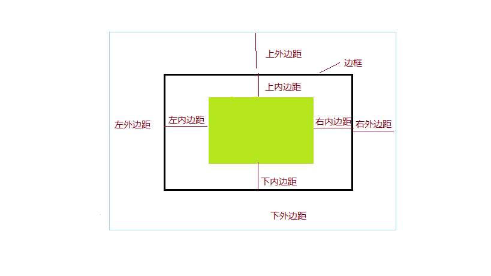

# CSS选择器和权重问题  [视频地址](http://pan.baidu.com/s/1gf2xKHl)



|选择器 | 含义|
|---|---|
|.box | 选择所有class为box的元素|
|.box+.box2| 选择class为box的兄弟元素中class为box2的元素|
|.box3 .box4 | 选择class为box3下的所有class为box4的元素| 
|.box5:hover |class为box5的元素鼠标悬停样式|

详情参加课后参考CSS选择器


# css权重问题
CSS有三种引入方式，外联，内联，元素样式。
CSS是层叠样式表的含义。
在相同权级的情况下,后面的样式会覆盖前面的样式。

|选择器|权重|
|---|---|
|直接作用在元素上的样式| 1000|
|id选择器 |100|
|类选择器|10|
|元素,伪类|1|

例如
```css
body{
    background:red;
}

/* 背景颜色覆盖为蓝色 */
body{
    background:blue;
}
```
[Demo2](https://plnkr.co/edit/jorSmNKiDUphAZuarONX?p=preview) 

在不同的权级下,更大权级的样式覆盖更低权级的样式。
例如
```css

/**权级为10+1=11,不会被.box覆盖,背景红色 */
div.box{
    background:red;
}

/* 权级为10 */
.box{
 background:blue;    

}

```
[demo3.html](http://htmlpreview.github.io/?https://github.com/24wings/tutorial/blob/master/css/demos/demo3.html)   [demo3源码](demos/demo3.html)


总结:
>  本课总结了几种基本的选择器和CSS权重问题。

参考以及课后阅读
* [CSS选择器 w3cschool](http://www.w3school.com.cn/cssref/css_selectors.ASP)
* [CSS权重 博客](http://www.cnblogs.com/rubylouvre/archive/2010/03/17/1687786.html)
* [w3c hover](http://www.w3school.com.cn/cssref/selector_hover.asp)

# 课后练习:

1. 使用css :hover选择器完成下拉菜单
    
    解读:hover是伪类选择器,当鼠标滑过选中的元素的时候会应用选择器的样式 参考w3c hover。


那么 如果有一段html如下方, 默认的话,dd下面的内容都会显示。现在需要做成下拉菜单的形式。


```html
<dl>
    <dt>水果</dt>
  
    <dd>
    <ul>
        <li>苹果</li>
        <li>香蕉</li>
        <li>龙眼</li>
        <li>榴莲</li>
        <li>梨子</li>
    </ul>
  </dd>  
</dl>
```
 
1. 先将 ul 设置一个类 .menuDetail  

```css
    /*
    *  <ul class="menuDetail">
    * </ul>
    */
.menuDetail{
    display:none;
}
```
这样默认就会隐藏菜单了

但是我们需要鼠标滑过水果的时候显示下面的菜单,于是增加css
```css
dt:hover+dd .menuDetail{
    display:block;
}
```
这样当鼠标滑过水果的时候,被滑过的水果的菜单就会显示了。有没有一点小激动呢,赶快去试试吧。
[作业代码](https://plnkr.co/edit/w3oPo7EYON04oVaEf24F?p=preview)